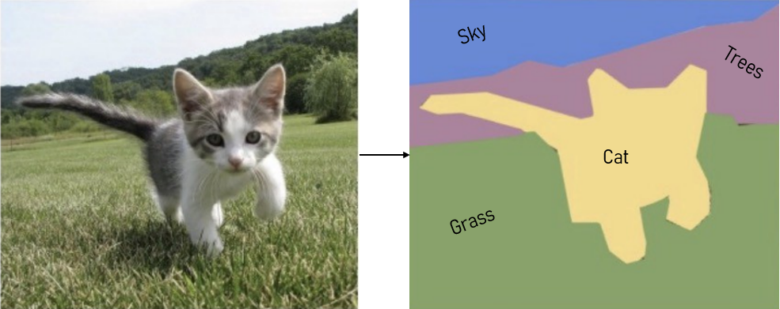

For this challenge we are going to run a couple of hypothetical scenarios. Each scenario mirrors the types of responsibilities you would assume for the position within our team.

The position includes:
* A data labelling component. You will be expected to review and assess the useability of the data processed by our labelling team. Your assessments must guide the team to labelling the data with increasing accuracy and decreasing error. These assessments will always include a qualitative and quantitative component. Which must be backed up with statistics
* A data generation component. In addition to the standard image augmentation operations we produce our own in house algorithms to create synthetic data. Your responsibilities would include implementing and testing these algorithms and their outputs
* A data management component. After all the data labelling and generation is done there is always a tonne of data to store and curate. Data, processed and unprocessed, must be easily accessible, referenceable and backed up on the cloud

# Data Labelling - Labeller Assessment
We've been contracted to make an AI that can find all of the dogs in a given image. We've opted to use a semantic segmentation approach.

The way semantic segmentation works is that parts of an image are coloured according to a given scheme, say for example we were interested in finding cats in an image and then splitting the background into parts, such as grass, sky and trees. Then we could label this image of a kitten as follows:


For this task we've chosen the following scheme:
* All dogs must be separately annotated, unless a dog occludes another dog then the two must be coloured by the same annotation
* The annotations must include as much of the dog as possible without excessive padding
* We must be able to confidently say that the annotation is for a dog. If only parts of the dog are visible or is too blurry, then it must be excluded
* We do not consider cartoons or caricatures, only pictures of real dogs

Before we start processing thousands of images we must train our labelling team and review their work to ensure that the quality of our labels is acceptable, otherwise the AI models will learn undesirable features, which will lower their performance.

Your task as the data custodian is to review the labeller's work and report on their performance. You can create whatever acceptance criteria you wish as long as it abides by the scheme. You must record your assessment and conclusions and make it available for us to look at. A formal report is not necessary but we must be able to determine if your assessment was sensible.

Finally, save your findings in a `json` file, so that you can access it for the next task.

# Data Generation - Working with Images
It's common practice within the team to process images after labelling. The types of processing we do depends on the task and model we're working on.

For this task you will be required to write a python script that removes only the annotated areas from the raw images and save them as their own images. The script must run with the following command:
```python
python extract_doggy_regions.py
```

You must extract only the good quality annotations. What counts as 'good' depends on your assessment from the previous task.

When you save the images, you can rewrite any of the images you've generated, but do not overwrite any of the images provided in this challenge. You must also name the images in a way that indicates which images the annotations originally came from.

Finally, you must write a script to combine all good quality annotations as one big collaged image. You cannot append the images in a single long rectangle, like this:
```
DDDDD

D
D
D
D
D
```

You must keep them as square as possible:
```
DDD
DDP

DDP
DDD
```

Where `D` is a doggy region and `P` is padding used to fill out the image.

It must run with the following command:
```python
python consolidate_doggy_regions.py
```

**NOTE**: This does not mean that the review will produce 5 good images, it's just for illustrative purposes. You may generate more or less.

# Data
The images are indexed from 0-34 and their corresponding annotations and overlays share the same index. The green in the annotation represents the dog and the white represents the background.

The raw data can be found in the `data/raw` folder. The annotations made by the labeller can be found in the `data/annotations` folder. The annotations have been overlayed onto the raw images for easy reviewing and are available in the `data/overlays` folder.

**NOTE**: All images were obtained under a creative commons license

# Final Thoughts
You may use which ever python libraries you wish to accomplish the task. Record the names of the packages in a `requirements.txt` file. Save all results in the `data` folder, in a meaningful way.
